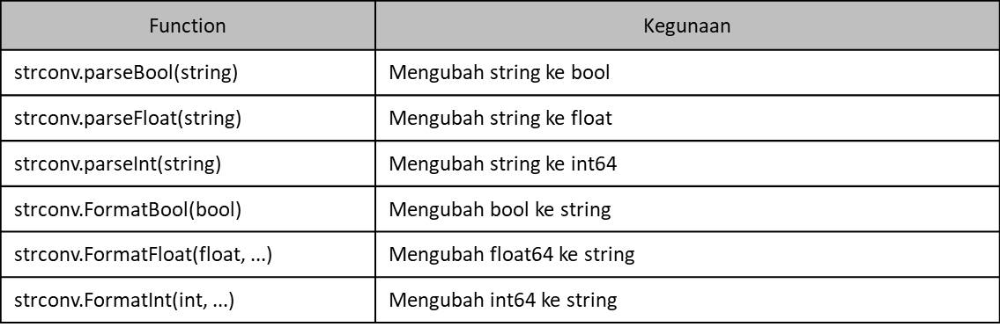

# Package strconv

- Atau disebut `string conversion`
- Sebelumnya kita sudah belajar cara konversi tipe data, misal dari int32 ke int64
- Bagaimana jika kita butuh melakukan konversi yang tipe datanya berbeda? Misal dari int ke string, atau sebaliknya
- Hal tersebut bisa kita lakukan dengan bantuan package strconv (string conversion)

  
